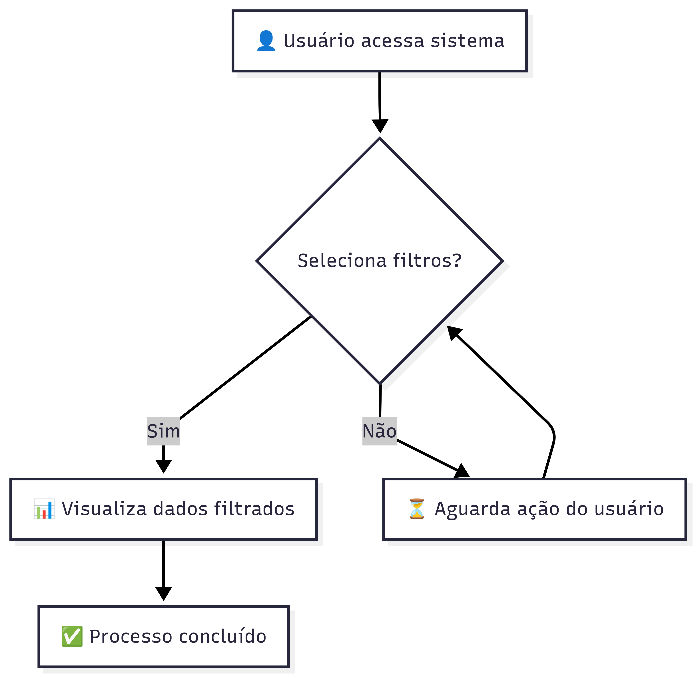
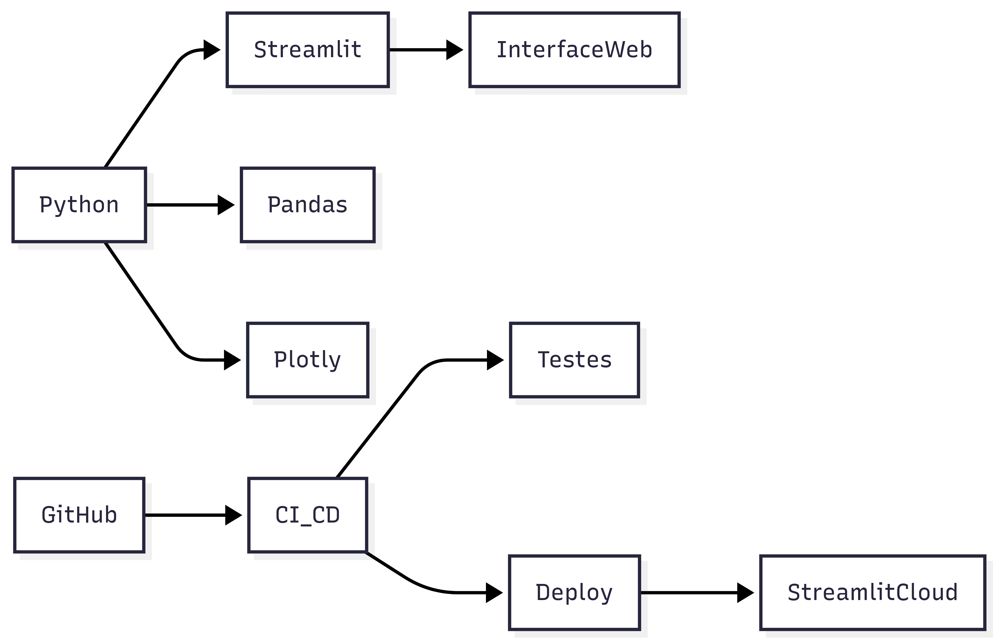
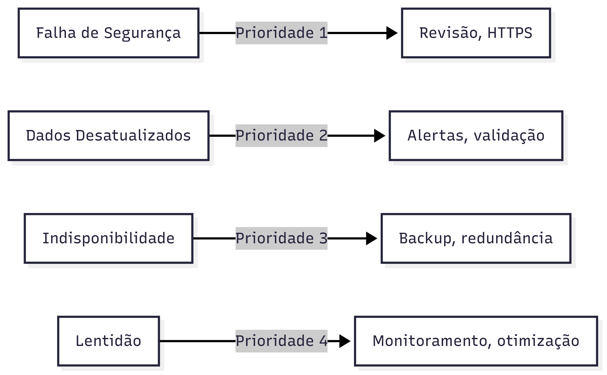

# Levantamento dos Requisitos Funcionais

O Fique Segura é uma aplicação web que tem como propósito central democratizar o acesso à informação sobre crimes de violência contra a mulher. Para atingir esse objetivo, o sistema deve reunir dados oficiais, processá-los e apresentá-los de maneira clara e acessível. A experiência do usuário é concebida para ser intuitiva, permitindo diferentes formas de consulta e visualização dos dados sem necessidade de autenticação.

Entre os requisitos funcionais, destacam-se:

- Centralização e apresentação de dados oficiais sobre violência de gênero.
- Filtros dinâmicos por município, estado, tipo de crime e faixa etária.
- Visualização de mapas interativos, gráficos e tabelas.
- Exportação dos dados filtrados em formato CSV.
- Atualização automática dos dados conforme novas fontes oficiais.
- Garantia de anonimização e privacidade dos dados.
- Consulta pública sem necessidade de autenticação.
- Deploy automático após commit na branch principal.
- Execução de testes via CI/CD.
- Instruções claras para instalação e contribuição no README.md.

Esses requisitos garantem que a aplicação seja útil para diversos perfis de usuários, desde cidadãos comuns até pesquisadores e gestores públicos.

# Levantamento dos Requisitos Não Funcionais

Além das funcionalidades, é fundamental que a aplicação mantenha altos padrões de desempenho, segurança e acessibilidade. O sistema deve ser robusto e confiável, proporcionando uma experiência positiva em diferentes cenários de uso. Os requisitos não funcionais são detalhados abaixo:

- **Desempenho:** O sistema deve responder às consultas em até 3 segundos, garantindo agilidade mesmo com múltiplos usuários simultâneos.
- **Escalabilidade:** Deve ser capaz de escalar horizontalmente, permitindo o aumento de capacidade conforme a demanda cresce.
- **Disponibilidade:** Espera-se que a aplicação opere 24x7, com mínima indisponibilidade.
- **Segurança:** Todos os dados trafegam de forma criptografada (HTTPS) e o sistema é protegido contra ataques como SQL Injection e XSS.
- **Privacidade:** Os dados são anonimizados na origem, em conformidade com a LGPD.
- **Usabilidade:** A interface deve ser intuitiva e adaptada a diferentes dispositivos.
- **Acessibilidade:** É necessário garantir que pessoas com deficiência possam utilizar a aplicação, adotando boas práticas de design universal.
- **Testabilidade:** O ambiente deve permitir a execução de testes automatizados e separação entre produção, homologação e desenvolvimento.

Esses requisitos garantem que o sistema não só funcione bem, mas também seja seguro, inclusivo e confiável.

# Requisitos Técnicos

O desenvolvimento da aplicação utiliza tecnologias modernas, priorizando flexibilidade e facilidade de manutenção. O backend será desenvolvido em Python, utilizando o framework Streamlit para a interface web. O processamento e visualização dos dados será feito com bibliotecas como Pandas e Plotly. O deploy automático será realizado via Streamlit Cloud, com integração ao GitHub Actions para CI/CD. Os testes automatizados serão implementados com Pytest e toda documentação técnica estará disponível no README.md do projeto.

Principais componentes técnicos:

- **Framework:** Streamlit para interface web.
- **Bibliotecas:** Pandas e Plotly.
- **Hospedagem:** Streamlit Cloud.
- **DevOps:** CI/CD com GitHub Actions.
- **Testes:** Pytest.
- **Versionamento:** Git e GitHub.

# Níveis Pretendidos dos Atributos de Qualidade ISO 25010

A qualidade do sistema é medida por diferentes atributos, conforme definido pela ISO 25010. Para o Fique Segura, além da adequação funcional, busca-se alcançar elevados níveis de confiabilidade, usabilidade, eficiência, segurança, manutenibilidade e portabilidade.

- **Confiabilidade:** Disponibilidade superior a 99.5%, com tempo de recuperação inferior a uma hora em caso de falhas.
- **Usabilidade:** Usuários devem concluir mais de 95% das tarefas nos testes de navegação, com alto nível de satisfação.
- **Eficiência de desempenho:** Tempo de resposta inferior a 3 segundos.
- **Segurança:** Proteção rigorosa, com dados anonimizados e criptografados.
- **Manutenibilidade:** Código modular e bem documentado, facilitando correções e evoluções.
- **Portabilidade:** Operação garantida em ambientes cloud e dispositivos móveis.

# Definição de Pronto e Critério de Aceitação

Para garantir a entrega de valor, um requisito é considerado pronto quando:

- Está implementado e testado conforme critérios de aceitação.
- Passa por validação em cenários Gherkin.
- Possui documentação atualizada.
- O deploy é realizado apenas após aprovação nos testes automatizados.

Exemplo de critérios de aceitação:

- O usuário consegue filtrar dados por município e tipo de crime.
- Informações exibidas são atualizadas e anonimizadas.
- Exportação dos dados funciona corretamente.
- Interface acessível e responsiva.

# Análise de Risco

A análise de risco é fundamental para antecipar problemas e estabelecer estratégias de mitigação. Os principais eventos indesejados tolerados pelos níveis de qualidade pretendidos incluem lentidão nas consultas, falhas na atualização dos dados, brechas de segurança e indisponibilidade do sistema.

A tabela a seguir resume os riscos, suas probabilidades, impactos e ações de mitigação:

| Evento             | Probabilidade | Impacto  | Mitigação                |
|--------------------|--------------|----------|--------------------------|
| Lentidão           | Média        | Média    | Monitoramento, otimização|
| Dados desatualizados| Baixa       | Alto     | Alertas, validação       |
| Falha de segurança | Baixa        | Crítico  | Revisão, HTTPS           |
| Indisponibilidade  | Baixa        | Média    | Backup, redundância      |

Riscos como exposição de dados pessoais devem ser tratados como prioridade máxima. Para cada risco, são sugeridas ações específicas visando reduzir a probabilidade ou o impacto em caso de ocorrência.

# Priorização dos Requisitos

A priorização dos requisitos é essencial para garantir que as funcionalidades mais críticas sejam entregues primeiro. Os requisitos essenciais envolvem:

1. Consulta pública aos dados anonimizados.
2. Filtros dinâmicos e visualização interativa.
3. Exportação de dados.
4. Atualização automática.
5. Segurança e privacidade.

A seguir, requisitos complementares como deploy automatizado, testes e integração contínua, documentação e acessibilidade ampliada também são considerados de alta prioridade, pois sustentam o crescimento e evolução do projeto.

# Priorização dos Riscos

A mitigação dos riscos segue uma ordem de prioridade baseada em impacto e probabilidade:

1. Segurança e privacidade dos dados.
2. Atualização dos dados.
3. Disponibilidade do sistema.
4. Desempenho sob carga.

Esse equilíbrio entre descrição textual, listas e diagramas permite uma compreensão completa e clara do projeto, reforçando a importância de cada aspecto abordado.
